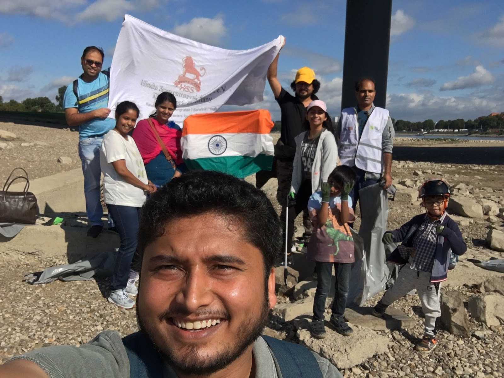

# Sewa Report 2021 

## Sewa work done during Second wave of Covid-19
Read the detailed sewa report [here](./Seva%20Europe%20Covid%20Report%20(2).pdf) 

## Sewa activity at EML Level
- Arranged Bhajan Sandhya in July 2021 in association with other organizations.

   

## Sewa work by done various countries

## Ukraine:-
- Planted trees
- Cleaning of rivers
- Bhajan Sandya(Bhajanamurta sandhya)
- Tog Mahostav
- Participated as volunteer for Shakuntal skit
- For students delivering grocery in cheap prices
- Provided food for mandir
- Ekal

## Neatherlands
- Started mandir sewa(cleaning)
- Shakha karyakartas delivered cooked foods to needy
- Contacted Old-age homes

## France
- 12 people are doing yoga and bauddhik together on every Sunday
- Helped to develop the temple association and supporing construction of temple

## Poland
- Helped Indian workers who were stranded due to Covid-19 with groceries.

## Norway
- Ekal meet
- Ekal donation:- 72 schools
- Sewa Day
- Beach cleaning Stavanger
- Helped children’s park to arrange the event
- Old age home visits
- Christmas Card distribution
- Sewa for Dandiya. 75000 NOK donated to Norwegian Cancer Society
-  https://www.facebook.com/hssnorway.org/videos/3069362240057842

## Finland
- Created a greeting cards and given to the doctors who were giving the vaccines

## Germany
- Cleaned river
-   

               

