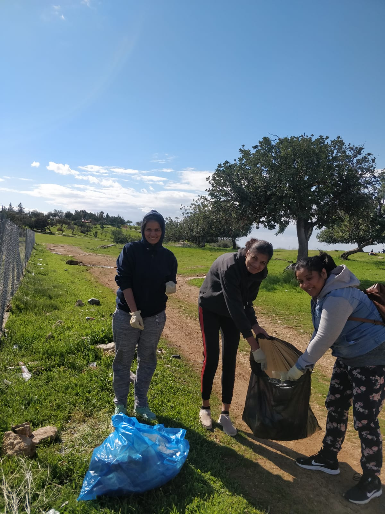
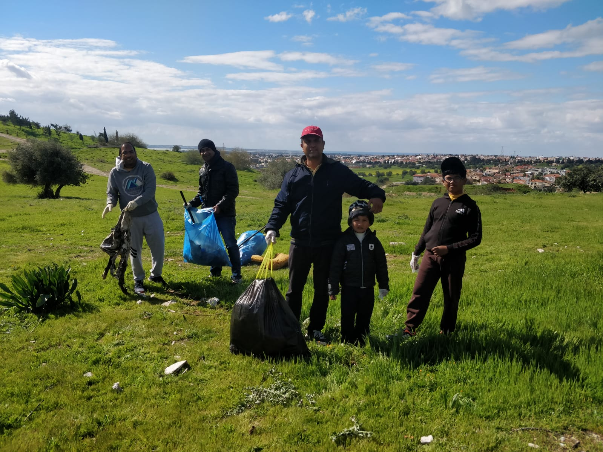
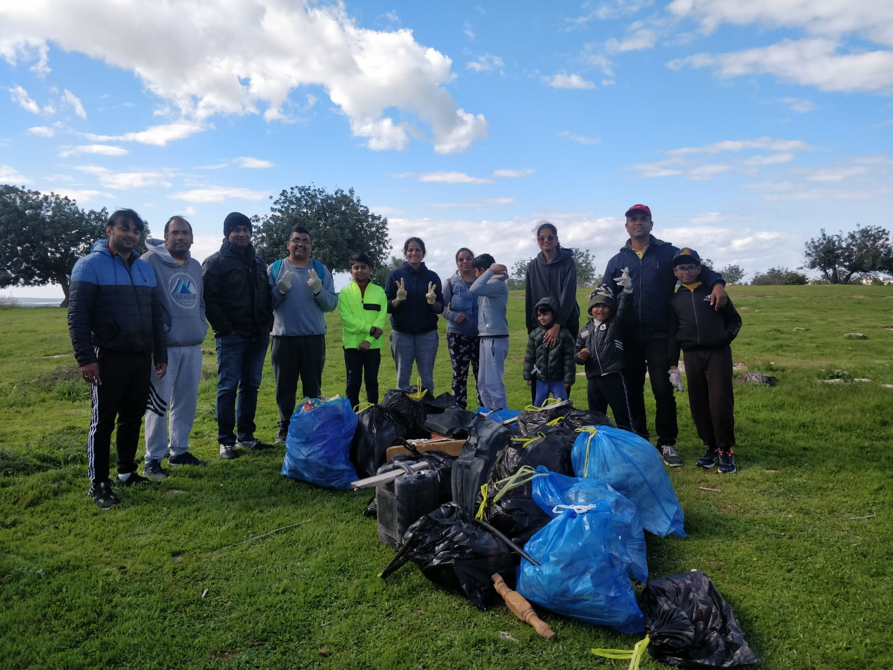

# Sewa Report 2022

## Sewa work by done various countries

## Cyprus:-

-Limassol Shakha mountain clean up activity today (12 march'22) was an overwhelming experience for children together with their parents.All 15 participants worked enthusiastically and enjoyed. Sewa initiatives are helping to  imbibe inner strength and ingestion of giver attitude towards society.

 
